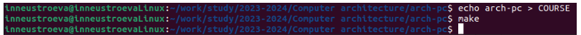

---
## Front matter
title: "Отчёт по лабораторной работе №2"
subtitle: "Дисциплина: архитектура компьютера"
author: "Неустроева Ирина"
## Generic otions
lang: ru-RU
toc-title: "Содержание"

## Bibliography
bibliography: bib/cite.bib
csl: pandoc/csl/gost-r-7-0-5-2008-numeric.csl

## Pdf output format
toc: true # Table of contents
toc-depth: 2
lof: true # List of figures
lot: true # List of tables
fontsize: 12pt
linestretch: 1.5
papersize: a4
documentclass: scrreprt
## I18n polyglossia
polyglossia-lang:
  name: russian
  options:
	- spelling=modern
	- babelshorthands=true
polyglossia-otherlangs:
  name: english
## I18n babel
babel-lang: russian
babel-otherlangs: english
## Fonts
mainfont: PT Serif
romanfont: PT Serif
sansfont: PT Sans
monofont: PT Mono
mainfontoptions: Ligatures=TeX
romanfontoptions: Ligatures=TeX
sansfontoptions: Ligatures=TeX,Scale=MatchLowercase
monofontoptions: Scale=MatchLowercase,Scale=0.9
## Biblatex
biblatex: true
biblio-style: "gost-numeric"
biblatexoptions:
  - parentracker=true
  - backend=biber
  - hyperref=auto
  - language=auto
  - autolang=other*
  - citestyle=gost-numeric
## Pandoc-crossref LaTeX customization
figureTitle: "Рис."
tableTitle: "Таблица"
listingTitle: "Листинг"
lofTitle: "Список иллюстраций"
lotTitle: "Список таблиц"
lolTitle: "Листинги"
## Misc options
indent: true
header-includes:
  - \usepackage{indentfirst}
  - \usepackage{float} # keep figures where there are in the text
  - \floatplacement{figure}{H} # keep figures where there are in the text
---

# Цель работы
Получить практические навыки по работе с системой git, изучить идеологию и применение средств контроля версий.

# 2 Задание
1. Цель работы
2. Теоретическое введение
3. Выполнение лабораторной работы
4. Вывод

# Теоретическое введение
Системы контроля версий (Version Control System, VCS) применяются при работе нескольких человек над одним проектом. Обычно основное дерево проекта хранится в локальном или удалённом репозитории, к которому настроен доступ для участников проекта. При внесении изменений в содержание проекта система контроля версий позволяет их фиксировать, совмещать изменения, произведённые разными участниками проекта, производить откат к любой более ранней версии проекта. В классических системах контроля версий используется централизованная модель, предполагающая наличие единого репозитория для хранения файлов. Выполнение большинства функций по управлению версиями осуществляется специальным сервером. Участник проекта перед началом работы посредством определённых команд получает нужную ему версию файлов. После внесения изменений, пользователь размещает новую версию в хранилище. При этом предыдущие версии не удаляются из центрального хранилища и к ним можно вернуться в любой момент. Сервер может сохранять не полную версию изменённых файлов, а производить так называемую дельта-компрессию — сохранять только изменения между последовательными версиями, что позволяет уменьшить объём хранимых данных. Системы контроля версий поддерживают возможность отслеживания и разрешения конфликтов, которые могут возникнуть при работе нескольких человек над одним файлом. Можно объединить (слить) изменения, сделанные разными участниками (автоматически или вручную), вручную выбрать нужную версию, отменить изменения вовсе или заблокировать файлы для изменения. В зависимости от настроек блокировка не позволяет другим пользователям получить рабочую копию или препятствует изменению рабочей копии файла средствами файловой системы ОС, обеспечивая таким образом, привилегированный доступ только одному пользователю, работающему с файлом. Системы контроля версий также могут обеспечивать дополнительные, более гибкие функциональные возможности. Например, они могут поддерживать работу с несколькими версиями одного файла, сохраняя общую историю изменений до точки ветвления версий и собственные истории изменений каждой ветви. Кроме того, обычно доступна информация о том, кто из участников, когда и какие изменения вносил. Обычно такого рода информация хранится в журнале изменений, доступ к которому можно ограничить. В отличие от классических, в распределённых системах контроля версий центральный репозиторий не является обязательным. Среди классических VCS наиболее известны CVS, Subversion, а среди распределённых — Git, Bazaar, Mercurial. Принципы их работы схожи, отличаются они в основном синтаксисом используемых в работе команд.

| Команда             | Описание                                                                                                                   |
|---------------------|----------------------------------------------------------------------------------------------------------------------------|
| `git init`          | Создание основного дерева репозитория                                                                                      |
| `git pull `         | Получение обновлений (изменений) текущего дерева из центрального репозитория                                               |
| `git push`          | Отправка всех произведённых изменений локального дерева в центральный репозиторий					   |
| `git status`        | Просмотр списка изменённых файлов в текущей директории 									   |
| `git diff`          | Просмотр текущих изменения												   |
| `git add . `        | Добавить все изменённые и/или созданные файлы и/или каталоги								   |
| `git add файл`      | Добавить конкретные изменённые и/или созданные файлы и/или каталоги							   |
| `git rm файл`       | Удалить файл и/или каталог из индекса репозитория (при этом файл и/или каталог остаётся в локальной директории)            |
| `git commit -am`    | Сохранить все добавленные изменения и все изменённые файлы								   |
| `git checkout -b `  | Создание новой ветки, базирующейся на текущей										   |
| `git checkout`      | Переключение на некоторую ветку 											   |
| `git push origin`   | Отправка изменений конкретной ветки в центральный репозиторий 								   |
| `git merge --no-ff` | Слияние ветки с текущим деревом 											   |
| `git branch -d`     | Удаление локальной уже слитой с основным деревом ветки  								   |
| `git branch -D`     | Принудительное удаление локальной ветки											   |
| `git push origin`   | Удаление ветки с центрального репозитория	

# Выполнение лабораторной работы

### Настройка GitHub

*1*
Переходим на сайт GitHub  и создаю учетную запись, заполняя основные данные (рис.@fig:006)

{fig:001 width=70%}

*3*
Открываю терминал на вертуальной машине и задаю предварительную конфигурацию git, введя команду git config –global user.name “”, указывая свое имя и команду gitc onfig –global user.email “work@mail”, указывая свою электронную почту (рис.@fig:007)

{fig:003 width=70%}

*4*
Настроим utf-8 в выводе сообщений git следующей командой: git config –global
core.quotepath false (рис.@fig:009) 

{fig:009 width=70%}

*5*
Далее задаю имя “master” для начальной ветки, введя команду: git config –glob
init.defaultBranch master (рис.@fig:010) 

{fig:010 width=70%}

*6*
Следующим шагом задаю параметр autocrlf со значением input следующей командой:
git config –global core.autocrlf input, чтобы все переводы строк текстовых файлов в
главном репозитории одинаковыми (конвертирую CRLF в LF
только при коммитах. CR и LF – это символы, которые используют для обозначения
разрыва строки в текстовых файлах (рис.@fig:011) 

{fig:011 width=70%}

*7*
Задаю параметр safecrlf со значением warn, таким образом Git будет проверять
является ли окончаний строк обратимым для текущей настройки core.autocrlf, будет
печатать предупреждение, но коммиты с необратимым переходом принимаются (рис.@fig:012) 

{fig:012 width=70%}

### Создание SSH ключа.

*1*
Для последующей идентификации пользователя на сервере репозиториев
необходимо сгенерировать приватный и открытый ключи, следующей командой: ssh-
keygen -C “Имя Фамилия, почта”, указывая свои данные, ключ автоматически
сохранится в каталоге ~/.ssh/ (рис.@fig:013)

{fig:013 width=70%}

*2*
Копирую открытый ключ из директории с помощью утилиты xclip(рис.@fig:014)

{fig:014 width=70%}

*3*
Затем перехожу на сайт GitHub В своем профилье
выбираю в боковом меню «SSH and GPG keys», нажимаю кнопку «New SSH key»(рис.@fig:015)

{fig:015 width=70%}

*4*
Далее в поле Title указываю свое имя для ключа. Вставляю скопированный ключ в
поле «Key». Нажимаю «Add SSH-key», чтобы завершить добавление ключа(рис.@fig:016)

{fig:016 width=70%}

*5*
Убедились, что создали ключ(рис.@fig:017)

{fig:017 width=70%}

### Создание рабочего пространства и репозитория курса на основе шаблона

*1*
открываю терминал, создаю рабочее пространство, с помощью команды mkdir и ключа -p создаю каталог для предмета Архитектура компьютера, по средством ввода следующей команды:
~/work/study/2023-2024/“Архитектура компьютера” Далее проверяю с помощью команды ls на
создание необходимого мне каталога.(рис.@fig:018)

{fig:018 width=70%}

### Создание репозитория курса на основе шаблона

*1*
Перешла на страницу репозитория с шаблоном курса по адресу
https://github.com/yamadharma/course-directory-student-template. Далее выбираю «Use
this template», для того чтобы использовать этот шаблон (рис.@fig:019)

{fig:019 width=70%}

*2*
В открывшемся окне задаю имя репозитория (Repository name): study_2023-2024_arch-
pc и создаю репозиторий, нажимаю на кнопку «Create repository»(рис.@fig:020)

{fig:020 width=70%}

*3*
Проверяем, что репозиторий study_2023–2024_arhpc успешно создан (рис.@fig:021)

{fig:021 width=70%}

*4*
Открыла терминал и с помощью команды cd перешла в созданный каталог курса (рис.@fig:022)

{fig:022 width=70%}

*5*
Следующим шагом, клонирую созданный репозиторий с помощью команды
git clone –recursive git@github.com: inneustroeva/study_2023–2024_arh-pc.git arch-pc (рис.@fig:023)

{fig:023 width=70%}

*6*
Затем на странице созданного репозитория копирую ссылку, перейдя в окно «code», далее выбрав в
окне вкладку «SSH» (рис.@fig:024)

{fig:024 width=70%}

### Настройка каталога курса

*1*
Перехожу в каталог arch-pc с помощью команды cd (рис.@fig:025)

{fig:025 width=70%}

*2*
 Далее создаю необходимые каталоги (рис.@fig:026)

{fig:026 width=70%}

*3*
Отправляю созданные файлы с локального репозитория на сервер: добавляю все
созданные каталоги с помощью git add, сохраняю изменения на сервере с помощью git
commit (рис.@fig:027)

{fig:027 width=70%}

*4*
Отправляю все на сервер с помощью команды git push (рис.@fig:028)

{fig:028 width=70%}

*5*
Проверяю правильность создания иерархии рабочего пространства в
локальном репозитории на сайте github (рис.@fig:029)

{fig:029 width=70%}

### Выполнение заданий для самостоятельной работы

*1*
Перехожу в директорию labs/lab02/report с помощью команды cd. Создаю в каталоге
файл для отчета по лабораторной работе с помощью утилиты touch (рис.@fig:030)

{fig:030 width=70%}

*2*
Открываю текстовый редактор LibreOffice Writer, через меню приложений.
И открываю в нём созданный файл (рис.@fig:031)

{fig:031 width=70%}

*3*
Далее перехожу в каталог lab01/report (рис.@fig:032)

{fig:032 width=70%}

*4*
Следующим шагом проверяю нахождение файла первой лабораторной работы, файл
находиться в Загрузках (рис.@fig:033)

{fig:033 width=70%}

*5*
Копирую первую лабораторную работу, с помощью команды cp, и перемещаю её в
нужный нам каталог (рис.@fig:034)

{fig:034 width=70%}

*6*
Проверяем правильность выполнения с помощью команды “ls” (рис.@fig:035)

{fig:035 width=70%}

*7*
Добавляю файл Л01_Неустроева_отчет.pdf на сервер, с помощью команды git add и сохраняю изменения на сервере с помощью git commit (рис.@fig:036)

{fig:036 width=70%}

*8*
Отправляю в центральный репозиторий сохраненные изменения командой git push -f
origin master (рис.@fig:037)

{fig:037 width=70%}

*9*
То же самое делаю для второй лабораторной работы: перехожу в директорию labs/lab02/report с помощью cd, добавляю с помощью git add нужный файл Л02_Неустроева_отчет, сохраняю изменения с помощью git commit (рис.@fig:038)

{fig:038 width=70%}

*10*
Отправляю в центральный репозиторий сохраненные изменения командой git push -f
origin master (рис.@fig:039) 

{fig:039 width=70%}

*11*
Проверяю на сайте GitHub правильность выполнения заданий. Вижу, что отчет по
лабораторной работе номер 1 находятся в соответствующем каталоге (рис.@fig:040) и
отчет по лабораторной работе номер 2 тоже находятся в соответствующем каталоге (рис.@fig:041)

{fig:040 width=70%}

{fig:041 width=70%}

# Выводы

Приобрела практические навыки по работе с сиcтемой git. Изучила идеологию и
применение средств контроля версий

::: {#refs}
:::
