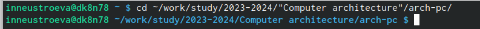
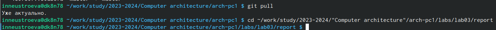
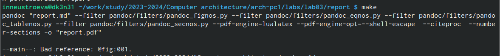
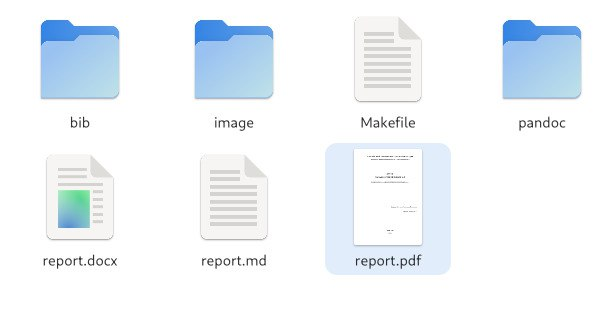
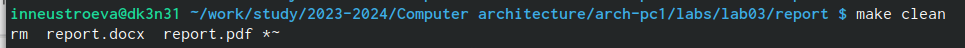
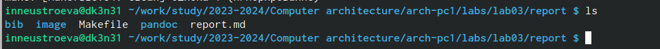
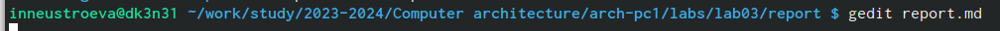
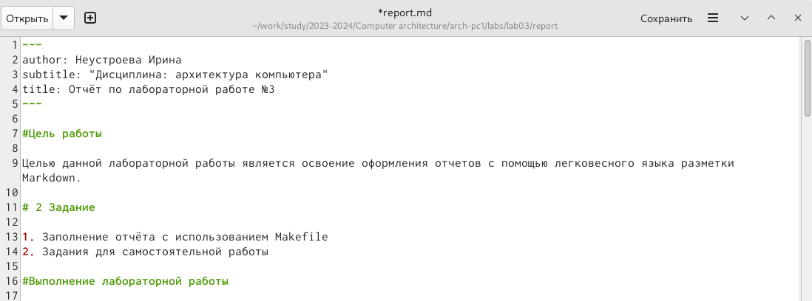

## Generic otions
lang: ru-RU
toc-title: "Содержание"

## Bibliography
bibliography: bib/cite.bib
csl: pandoc/csl/gost-r-7-0-5-2008-numeric.csl

## Pdf output format
toc: true # Table of contents
toc-depth: 2
lof: true # List of figures
lot: true # List of tables
fontsize: 12pt
linestretch: 1.5
papersize: a4
documentclass: scrreprt
## I18n polyglossia
polyglossia-lang:
  name: russian
  options:
	- spelling=modern
	- babelshorthands=true
polyglossia-otherlangs:
  name: english
## I18n babel
babel-lang: russian
babel-otherlangs: english
## Fonts
mainfont: PT Serif
romanfont: PT Serif
sansfont: PT Sans
monofont: PT Mono
mainfontoptions: Ligatures=TeX
romanfontoptions: Ligatures=TeX
sansfontoptions: Ligatures=TeX,Scale=MatchLowercase
monofontoptions: Scale=MatchLowercase,Scale=0.9
## Biblatex
biblatex: true
biblio-style: "gost-numeric"
biblatexoptions:
  - parentracker=true
  - backend=biber
  - hyperref=auto
  - language=auto
  - autolang=other*
  - citestyle=gost-numeric
## Pandoc-crossref LaTeX customization
figureTitle: "Рис."
tableTitle: "Таблица"
listingTitle: "Листинг"
lofTitle: "Список иллюстраций"
lotTitle: "Список таблиц"
lolTitle: "Листинги"
## Misc options
indent: true
header-includes:
  - \usepackage{indentfirst}
  - \usepackage{float} # keep figures where there are in the text
  - \floatplacement{figure}{H} # keep figures where there are in the text
---
---
author: Неустроева Ирина
subtitle: "Дисциплина: архитектура компьютера"
title: Отчёт по лабораторной работе №3
---

#Цель работы

Целью данной лабораторной работы является освоение оформления отчетов с помощью легковесного языка разметки Markdown.

# 2 Задание

1. Заполнение отчёта с использованием Makefile
2. Задания для самостоятельной работы

#Выполнение лабораторной работы

*1*
Перешла в терминал 

*2*
Перешла в каталог курса формирований при выполнении лабораторной работы №2 (рис.@fig:001)

{[#fig:001 width=70%]}

*3*
Обновила локальный репозиторий, скачав изменения из удаленного репазитория с помощью команды git pull и перешла в каталог с шаблоном отчета (рис.@fig:002)
{[#fig:002 width=70%]}

*4*
Провела компиляцию шаблона с использованием Makefile с помощью ко-манды make (рис.@fig:003)
{[#fig:003 width=70%}]

*5*
Проверила сгенерированные файлы (рис.@fig:004)
{[#fig:004 width=70%]}

*6*
Удалила полученные файлы с использованием Makefile с помощью коман-ды make clean (рис.@fig:005)
{[#fig:005 width=70%]}

*7*
Проверила, удалились ли файлы (рис.@fig:006)
{[#fig:006 width=70%]}

*8*
Открыла файл report.md с помощью текстового редактора gedit и внимательно изучила структуру этого файла (рис.@fig:007)
{[#fig:007 width=70%]}

*9*
Оформила отчёт лабораторной работы № 3 в формате Markdown(рис.@fig:008)
{[#fig:008 width=70%]}

# Выводы

Освоила процедуру оформления отчётов с помощью легковесного языка
разметки Markdown.

::: {#refs}
:::

