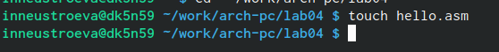

---
## Front matter
title: "Отчёта по лабораторной работе №4"
subtitle: "Дисциплина архитектура компьютера"
author: "Неустроева Ирина"

## Generic otions
lang: ru-RU
toc-title: "Содержание"

## Bibliography
bibliography: bib/cite.bib
csl: pandoc/csl/gost-r-7-0-5-2008-numeric.csl

## Pdf output format
toc: true # Table of contents
toc-depth: 2
lof: true # List of figures
lot: true # List of tables
fontsize: 12pt
linestretch: 1.5
papersize: a4
documentclass: scrreprt
## I18n polyglossia
polyglossia-lang:
  name: russian
  options:
	- spelling=modern
	- babelshorthands=true
polyglossia-otherlangs:
  name: english
## I18n babel
babel-lang: russian
babel-otherlangs: english
## Fonts
mainfont: PT Serif
romanfont: PT Serif
sansfont: PT Sans
monofont: PT Mono
mainfontoptions: Ligatures=TeX
romanfontoptions: Ligatures=TeX
sansfontoptions: Ligatures=TeX,Scale=MatchLowercase
monofontoptions: Scale=MatchLowercase,Scale=0.9
## Biblatex
biblatex: true
biblio-style: "gost-numeric"
biblatexoptions:
  - parentracker=true
  - backend=biber
  - hyperref=auto
  - language=auto
  - autolang=other*
  - citestyle=gost-numeric
## Pandoc-crossref LaTeX customization
figureTitle: "Рис."
tableTitle: "Таблица"
listingTitle: "Листинг"
lofTitle: "Список иллюстраций"
lotTitle: "Список таблиц"
lolTitle: "Листинги"
## Misc options
indent: true
header-includes:
  - \usepackage{indentfirst}
  - \usepackage{float} # keep figures where there are in the text
  - \floatplacement{figure}{H} # keep figures where there are in the text
---

# Цель работы

Освоение процедуры компиляции и сборки программ, написанных на ассемблере NASM.

# 2 Задание

1. Создание программы Hello world!
2. Транслятор NASM
3. Расширенный синтаксис командной строки NASM
4. Компоновщик LD
5. Запуск исполняемого файла
6. Задания для самостоятельной работы

# Выполнение лабораторной работы

## Создание программы Hello world!
*1*
Перешла в терминал 

*2*
Создала каталог для работы с программами на языке ассемблера NASM и перешла в созданный каталог:  (рис.@fig:02)

{#fig:02 width=70%}

*3*
Создала текстовый файл с именем hello.asm (рис.@fig:03)

{#fig:03 width=70%}

*4*
Открыла этот файл с помощью текстового редактора gedit (рис.@fig:04)

{#fig:04 width=70%}

*5*
Ввела в него текст: (рис.@fig:05)

{#fig:05 width=70%}

## Транслятор NASM
*1*
Компилирую приведенный выше текст и проверяю его. В результате транслятор преобразует текст программы
из файла hello.asm в объектный код, который запишется в файл hello.o.  (рис.@fig:06)

{#fig:06 width=70%}

## Расширенный синтаксис командной строки NASM
*1*
Cкомпилировала исходный файл hello.asm в obj.o , при этом формат выходного файла будет elf, и в него будут включены символы для отладки (опция -g), кроме того, будет создан файл листинга list.lst (опция -l). С помощью команды ls проверила, что файлы были созданы.(рис.@fig:07)

{#fig:07 width=70%}

## Компоновщик LD
*1*
Чтобы получить исполняемую программу,объектный файл передала на обработку компоновщику.С помощью команды ls проверила, что исполняемый файл hello был создан(рис.@fig:08)

{#fig:08 width=70%}

*2*
Выполняю следующую команду. Исполняемый файл будет иметь имя main, т.к. после ключа -о было задано значение main. Объектный файл, из которого собран этот исполняемый файл, имеет имя obj.o(рис.@fig:010)

{#fig:010 width=70%}

## Запуск исполняемого файла
*1*
Запускаю на выполнение созданный исполняемый файл hello (рис.@fig:011)

{#fig:011 width=70%}

## Задания для самостоятельной работы
*1*
В каталоге ~/work/arch-pc/lab04 с помощью команды cp создала копию файла hello.asm с именем lab4.asm и выполнила проверку (рис.@fig:012)

{#fig:012 width=70%}

*2*
С помощью текстового редактора внесла изменения в текст программы в файле lab4.asm так, чтобы вместо Hello world! на экран выводилась строка с моей фамилией и именем.(рис.@fig:013)

{#fig:013 width=70%}

*3*
Оттранслировала полученный текст программы lab4.asm в объектный файл.И выполнила проверку(рис.@fig:014)

{#fig:014 width=70%}

*4*
Выполнила компоновку объектного файла.И выполнила проверку (рис.@fig:015)

{#fig:015 width=70%}

*5*
Запустила получившийся исполняемый файл (рис.@fig:016)

{#fig:016 width=70%}

*6*
Скопировала файлы hello.asm и lab4.asm в локальный репозиторий в каталог ~/work/study/2023-2024/"Computer architecture"/arch-pc1/labs/lab04/. (рис.@fig:017)

{#fig:017 width=70%}

*7*
Загрузила файлы на Github (рис.@fig:018)

{#fig:018 width=70%}

# Выводы

Освоила процедуры компиляции и сборки программ, написанных на ассемблере NASM. .

::: {#refs}
:::
